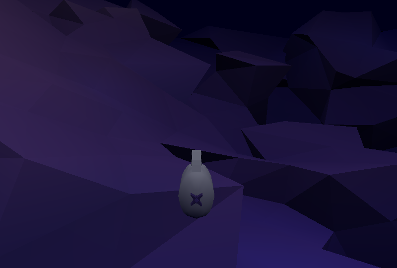

# Sea Scraper

Author: Jan Orlowski

Design: Explore the deep sea water and take in the atmosphere. 

Screen Shot:

How To Play:

W to accelerate
S to decelerate
A to rotate left
D to rotate right
Q to descend
E to ascend

Sources:

All 3D models (Blender) and music (FL Studio) were made by me.

This game was built with [NEST](NEST.md).
